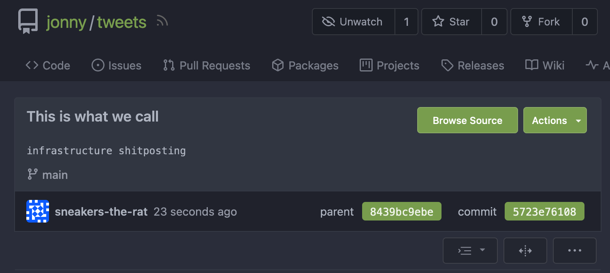
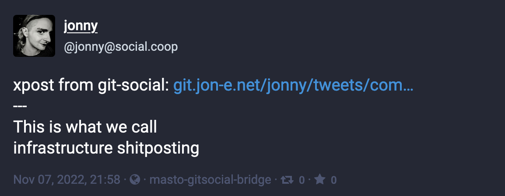
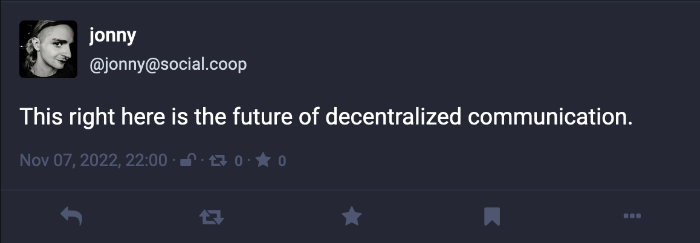
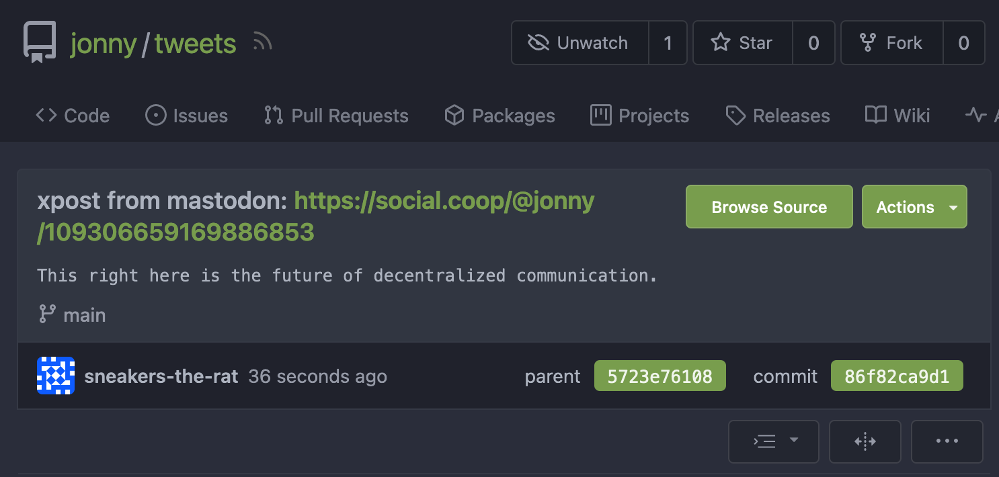

# masto-gitsocial-bridge

bridge between mastodon and bcrypt's [git-social](https://github.com/diracdeltas/tweets)

Mirrored to https://github.com/sneakers-the-rat/masto-gitsocial-bridge if for some godforsaken reason you want to raise issues or pull requests or fork it or whatever

## From git to masto

Post on git-social...



Bridge to mastodon



## From masto to git

Post on mastodon...



Bridge to git-social



# Features

Everything in this package is a bug and not a feature.

# Setup

## Installation

I'm not going to uh, make this good or put it on pypi or anything.

So you should clone this and install it with poetry, (otherwise
you have to modify the below `post-commit` action to activate the
venv where it is installed correctly)

```shell
git clone https://git.jon-e.net/jonny/masto-gitsocial-bridge
cd masto-gitsocial-bridge
poetry install
```

## Make masto token

~ check with your instance's policies before doing something bad like this ~

From your masto instance's homepage...

- Preferences (in hamburger menu top right if page is narrow)
- Development tab
- New Application

The bot needs permissions (I'm honestly not sure you need to give all of `read`, but 
`Mastodon.py`'s `me()` method seems to need a lot of them. idk.)
- `read`
- `write:lists` - the bot only streams your posts by making a list with just you on it
- `write:statuses` - to xpost, dummy!

Then copy the resulting access token for use in configuration...

## Config

See `masto_git_bridge.config.Config` for the required configuration values.

The config object uses Pydantic to load either from an `.env` file or 
from environment variables, for example, make an `.env` file in the cloned
repository directory like

```
MASTOGIT_MASTO_URL="https://social.coop"
MASTOGIT_MASTO_TOKEN="<mastodon bot access token>"
MASTOGIT_GIT_REPO="/path/to/your/git-social/tweets"
MASTOGIT_GIT_REMOTE_URL="https://git.jon-e.net/jonny/tweets"
MASTOGIT_LOGDIR="/wherever/you/want/to/put/logs"
```

This is assuming you don't need any sort of authentication/local password
on your local git repository in order to commit or push to it.

## `post-commit` action

In your git-social repository, make a `post-commit` action (`.git/hooks/post-commit`)
that looks something like this (see the [sample](post-commit.sample))

```bash
#!/bin/bash
# Assuming we have installed the package using poetry from a git repository
# lmao I did not say we handled virtual environments well in this package

cd <path/to/masto-gitsocial-bridge>
poetry run post_last_commit

# otherwise activate whatever venv you have installed the package in and
# call masto_git_bridge.main:post_last_commit, which is
# installed as an entrypoint script by poetry
```

# Usage

The post-commit action should run anytime you commit a post to git-social, but to post
from mastodon you'll have to run the bot, which listens for your posts and reposts them to 
git-social (only if they are "public" or "unlisted").

```bash
poetry run masto_gitbot
# or 
# >>> poetry shell
# >>> masto_gitbot
# or however else you run python entrypoint scripts
# hell you could do python -m masto_git_bridge.main:masto_gitbot
# i think?
```

# Warnings & Gotchas

If you ever enable this, you should promptly disable it